<div align="center">
  
  <h1>FortenLog</h1>
  <p><b>The Ultimate Telemetry, Analytics & Crash Reporting Engine.</b></p>
  <p><i>Zero-bloat. Phenomenal throughput. Drop-in compatibility.</i></p>

  <p>
    <a href="#features"></a>
    <a href="#compatibility"></a>
    <a href="#license"></a>
  </p>
</div>

> [!WARNING]
> **Public Beta Notice**
> FortenLog is currently in public Beta. While it is stable and highly optimized, breaking changes to the API or storage engine may still occur. Use in production with caution.

---

## 📸 Screenshots

<p align="center">
  <b>Issues Feed & Error Tracking</b><br>
  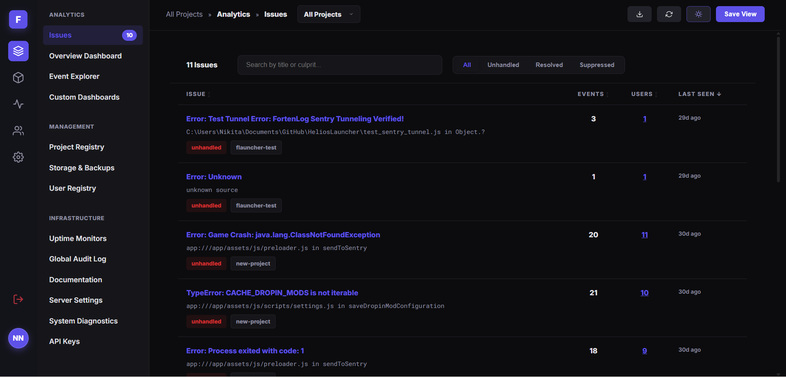
</p>

<p align="center">
  <b>Analytics & Telemetry Dashboard</b><br>
  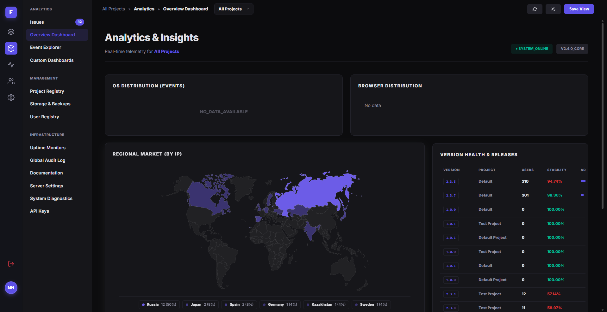
</p>

<div align="center">
  <table>
    <tr>
      <td align="center" width="50%">
        <b>Login Portal</b><br>
        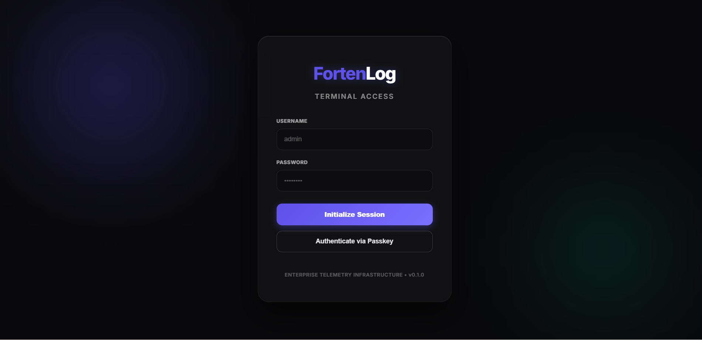
      </td>
      <td align="center" width="50%">
        <b>Uptime Monitoring Probes</b><br>
        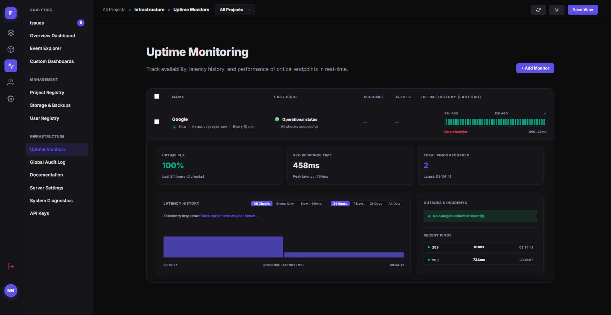
      </td>
    </tr>
    <tr>
      <td align="center" width="50%">
        <b>Issue Details (Highlights)</b><br>
        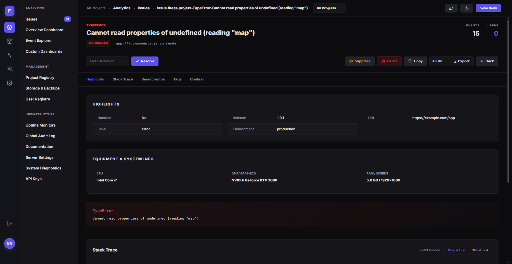
      </td>
      <td align="center" width="50%">
        <b>Issue Details (Stack Trace)</b><br>
        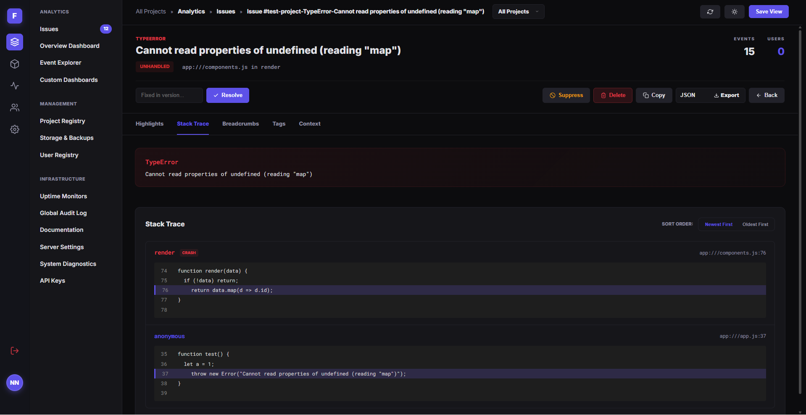
      </td>
    </tr>
    <tr>
      <td align="center" width="50%">
        <b>Global Events Explorer</b><br>
        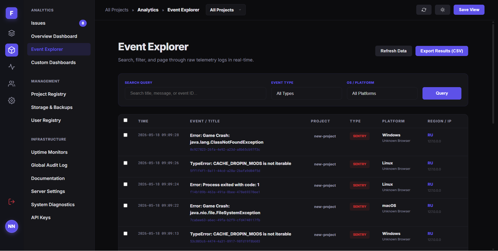
      </td>
      <td align="center" width="50%">
        <b>Payload Inspector</b><br>
        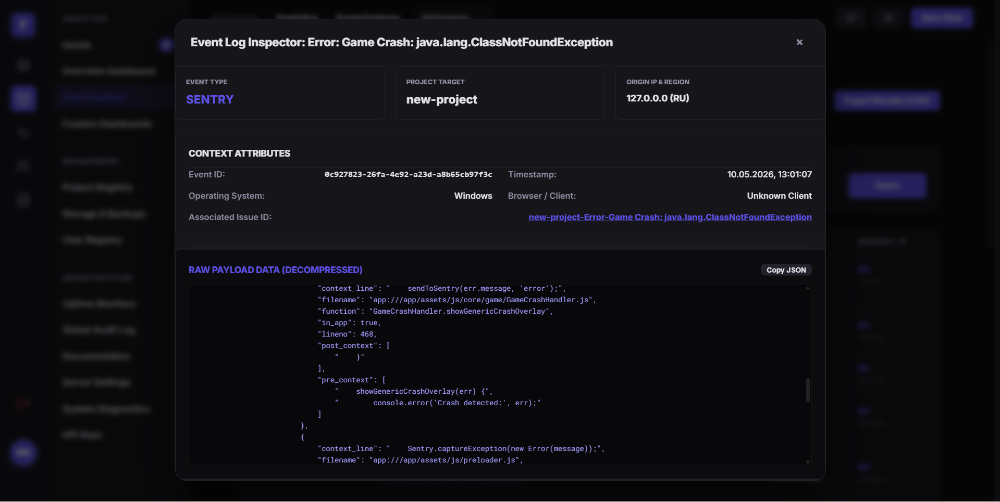
      </td>
    </tr>
    <tr>
      <td align="center" width="50%">
        <b>Storage Management & Compaction</b><br>
        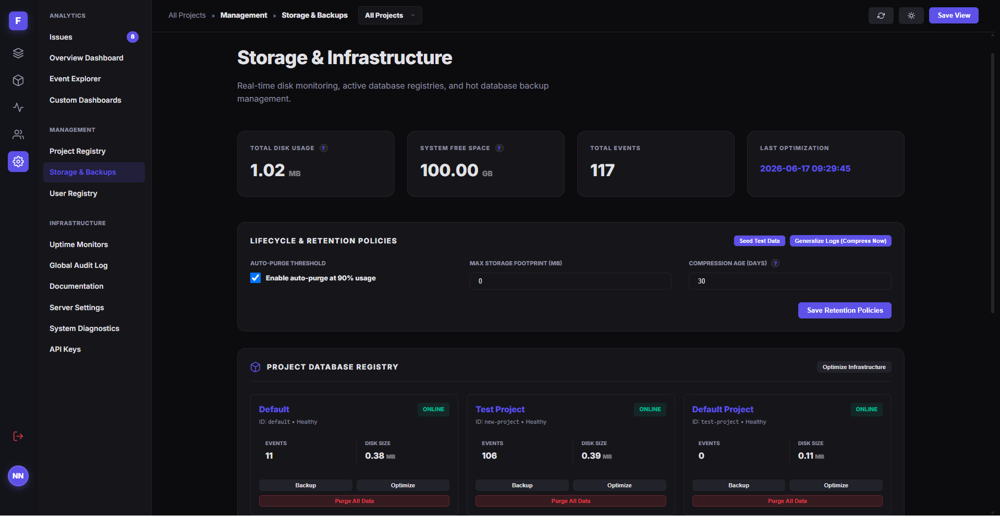
      </td>
      <td align="center" width="50%">
        <b>User Administration</b><br>
        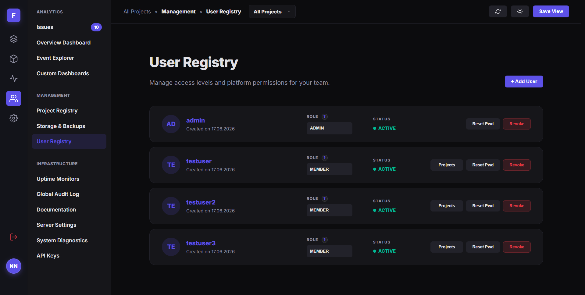
      </td>
    </tr>
    <tr>
      <td align="center" width="50%">
        <b>Sleek Light Theme support</b><br>
        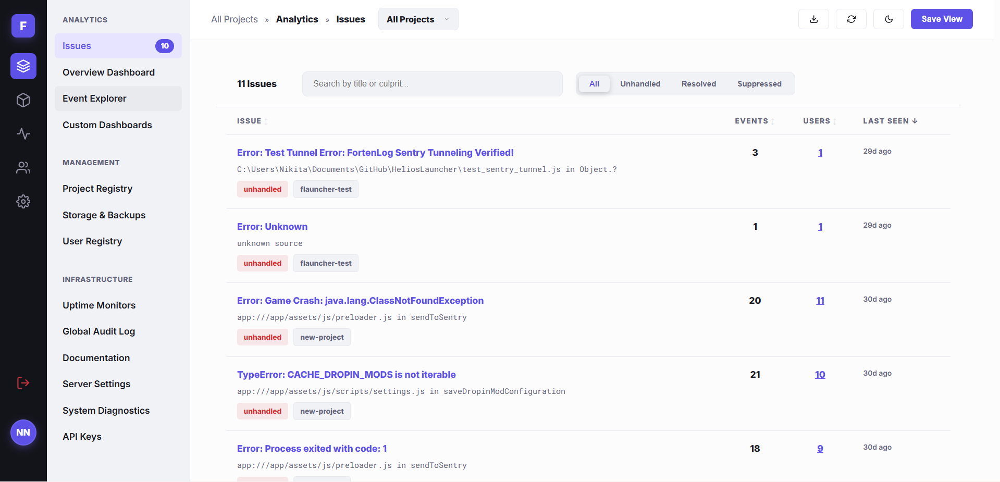
      </td>
      <td align="center" width="50%">
        <!-- Empty cell to balance layout -->
      </td>
    </tr>
  </table>
</div>

---

## 🛑 The Problem with Modern Telemetry
If you are building software today, you have two bad choices for telemetry:
1. **The Industrial Behemoths:** They consume dozens of gigabytes of RAM, require complex Elasticsearch/Kafka clusters to maintain, take days to deploy, and cost a fortune to run.
2. **The "Simple" Loggers:** They are lightweight, but completely lack analytical depth. They don't support custom dashboards, lack proper SDK integrations, and struggle to scale past a few requests per second without locking up.

## ⚡ The FortenLog Solution
FortenLog is built from the ground up in **async Rust** to solve both problems simultaneously. It is an enterprise-grade observability suite packaged into a **single, incredibly optimized binary**. 

### 🌍 Built for Total Control & Compliance
* **Runs Anywhere:** From the most powerful dedicated servers down to the **cheapest, smallest VPS** with just 2GB of RAM.
* **Perfect for Any Scale:** Excellent for small and medium-sized projects that don't want to pay massive SaaS telemetry fees, while scaling flawlessly for larger traffic spikes.
* **Strict Privacy Laws (GDPR/HIPAA):** Because you self-host FortenLog entirely on your own infrastructure, no third-party ever sees your user data. It is the perfect solution for countries with data residency and privacy laws. **You own your data, you control the infrastructure.**

By stripping away JVM, Kafka, and Elasticsearch dependencies, FortenLog is **up to 100x more resource-efficient and economical** than self-hosting traditional Sentry or PostHog clusters, while providing flawless drop-in compatibility for their SDKs. It provides industrial-scale crash reporting, deep custom analytics, and server uptime monitoring—all while consuming a fraction of the hardware resources.

---

## ✨ Why FortenLog? (Key Capabilities)

### 1. 🔌 Native Drop-In Sentry & PostHog Compatibility
You do **not** need to rewrite your application or use experimental SDKs. FortenLog natively speaks the ingestion protocols of standard industry SDKs.
* **Crash Reporting:** Point your official `sentry-sdk` (Node, Python, Java, Rust, Electron) to your FortenLog server. It automatically parses Sentry envelopes, intercepts unhandled exceptions, and captures local stack traces.
* **Custom Analytics:** Point `posthog-js` or `posthog-node` to FortenLog. It captures pageviews, tracks custom button clicks, and stores deeply nested analytical properties with zero extra configuration.

### 2. 🚀 Phenomenal Performance & Resource Efficiency
FortenLog processes massive amounts of data on hardware that would normally choke other systems.
* **Asynchronous Queues:** HTTP requests are absorbed instantly (`200 OK`) and pushed into a Tokio MPSC channel buffer. Spikes of 10,000+ RPS are absorbed without breaking a sweat.
* **Batched Disk I/O:** The background worker groups hundreds of events into a single SQLite transaction. This minimizes raw disk operations, maximizing NVMe throughput.
* **High-Speed Reads:** The analytical dashboard utilizes Write-Ahead Logging (WAL) and targeted indexing. Even complex aggregations over millions of rows render in the dashboard instantaneously.

**Observed Scaling Behavior:**
* 🟢 **Idle State:** Negligible system footprint with near-zero background CPU and RAM consumption.
* 🟡 **Sustained Traffic:** Batch transactions collapse hundreds of disk writes into a single commit, keeping overall system resource usage extremely low.
* 🔴 **Massive Spikes:** High-capacity memory buffers absorb heavy client traffic spikes without exhausting host server memory, maintaining sub-millisecond API response times.

### 3. 🛡️ Absolute Data Isolation (Per-Project Resources)
We do not dump all your logs into one massive, slow database table. 
Every project in FortenLog receives its own **physically isolated SQLite database file**. 
* **Zero Cross-Talk:** An aggressive analytical query in Project A will never lock up or slow down the ingestion queue of Project B.
* **Dynamic Connection Pools:** Project pools are loaded into memory dynamically on-demand and cached securely.

### 4. 🧹 Automatic GDPR-Compliant Storage Policies
You don't need to write manual cron jobs to prevent your disks from filling up. FortenLog implements a highly intelligent storage engine:
* **Sensitive Data Purging:** By default, PII (IP addresses, specific user agents, deep crash diagnostics) are scrubbed after **14 days**.
* **Statistical Rollups:** When raw data is deleted, the statistical aggregations (daily active users, crash counts, browser distributions) are strictly preserved! You keep your long-term analytical trends forever, without paying the storage cost of keeping millions of raw rows.
* **Background Compaction:** A dedicated background worker continuously `VACUUM`s and compresses historical data.

### 5. ⏱️ 60-Second Deployment
Deploying FortenLog is laughably simple. No external database servers to set up. No Kafka. No Redis. Just one binary.

---

## 🛠️ Production Deployment

FortenLog is designed to be easily deployed on any virtual private server (VPS) or cloud node. Below are the two primary deployment workflows.

### Method 1: Manual Docker Compose (Recommended for Custom Architectures)
This is the simplest way to run FortenLog using standard container tools. You can orchestrate the platform using the built-in `docker-compose.yml` config and handle SSL termination using Caddy, Nginx, or an upstream load balancer.

1. **Clone the repository on your server:**
   ```bash
   git clone https://github.com/FortenLog/FortenLog.git
   cd FortenLog
   ```

2. **Configure environment variables:**
   Create a `.env` file in the project root:
   ```env
   FORTENLOG_ADMIN_USER=admin
   FORTENLOG_ADMIN_PASS=secure_password_123_change_me
   PORT=3000
   ```

3. **Start the containers:**
   ```bash
   docker compose up -d
   ```
   The application server is now running locally on port `3000`. You can proxy public traffic to it using your favorite reverse proxy.

   **Caddyfile Example (Automatic SSL):**
   ```caddyfile
   telemetry.yourdomain.com {
       reverse_proxy 127.0.0.1:3000
   }
   ```

   **Nginx Configuration:**
   ```nginx
   server {
       listen 80;
       server_name telemetry.yourdomain.com;
       location / {
           proxy_pass http://127.0.0.1:3000;
           proxy_set_header Host $host;
           proxy_set_header X-Real-IP $remote_addr;
           proxy_set_header X-Forwarded-For $proxy_add_x_forwarded_for;
       }
   }
   ```

---

### Method 2: Automated Production VPS Deployer (Batteries Included)
For a fully automated, production-hardened setup, we provide an interactive deployment script that installs all dependencies, configures Let's Encrypt certificates, sets up a secure reverse proxy, and implements DDoS protection.

1. **Navigate to the deployment suite:**
   ```bash
   cd deployment
   chmod +x prod_deploy.sh prod_update.sh
   ```

2. **Execute the interactive deployer:**
   ```bash
   ./prod_deploy.sh
   ```

**What this script does automatically:**
- **System Dependency Checker:** Verifies or installs Docker and Docker Compose on the host.
- **SSL Automation:** Configures automated HTTP Let's Encrypt certificates or allows self-signed certificates for intranet/air-gapped networks.
- **Nginx Rate Limiting:** Sets up Nginx reverse-proxy rules to block ingestion bursts and protect against brute-forcing.
- **Hardened Security Policies:** Restricts `.env` and volume access permissions on the host system.

---

### 🔄 Updating FortenLog

To update your installation to the latest version without losing any analytical records:

* **If using Method 1:**
  ```bash
  git pull
  docker compose down
  docker compose up -d --build
  ```

* **If using Method 2:**
  ```bash
  cd deployment
  ./prod_update.sh
  ```

---

## 💻 Integration Examples

Integrating FortenLog into your apps is completely painless.

### React / Next.js (PostHog Analytics)
```javascript
import posthog from 'posthog-js';

// FortenLog natively understands PostHog SDK payloads!
posthog.init('fl_project_api_key_123', {
    api_host: 'https://telemetry.yourdomain.com',
    autocapture: true // Automatically tracks clicks and pageviews
});

// Track custom interactions
posthog.capture('user_purchased_item', {
    item_value: 49.99,
    category: 'electronics'
});
```

### Node.js / Python (Sentry Crash Tracking)
```javascript
import * as Sentry from "@sentry/node";

// ⚠️ Use a numerical ID in the DSN to bypass Sentry's local regex validation
// Route the actual data using the tunnel option
Sentry.init({
  dsn: "https://[API_KEY]@telemetry.yourdomain.com/1",
  tunnel: "https://telemetry.yourdomain.com/api/[PROJECT_ID]/envelope/?sentry_key=[API_KEY]",
  tracesSampleRate: 1.0,
});

try {
  throw new Error("Critical database failure!");
} catch (e) {
  Sentry.captureException(e);
}
```

---

## 🧩 Industrial Feature Suite

Despite its minimal footprint, FortenLog replaces a massive stack of observability tools:

- 📊 **Custom Dashboard Builder:** Create visual bar charts, line graphs, and tables based on any schemaless JSON property sent by your clients.
- 🚦 **Uptime Monitoring:** Configure HTTP/TCP probes to constantly ping your external microservices. Get SSL expiration warnings and latency graphs directly in the dashboard.
- 🚨 **Crash Triage:** Manage intercepted stack traces just like you would in Sentry. Mark issues as resolved, assign priority, and monitor regressions.
- 🔔 **Alerting & Webhooks (Coming Soon):** Dispatch automated alerts to Slack or Discord when a service drops or error rates spike.
- 🔐 **Hardened Security:** Built-in Argon2id password hashing, active session management, strict IP-binding, and WebAuthn (YubiKey) 2FA support (Coming Soon).

---

## 📚 Deep-Dive Documentation

Want to understand the inner workings? Check out our detailed documentation:
- [Architectural Overview](docs/architecture/overview.md) - Deep dive into our MPSC channels, SQLite WAL optimizations, and rollups.
- [Security Hardening](docs/security/hardening.md) - Details on CSRF defense, Stealth Mode, and GDPR compliance.
- [Implementation Details](docs/IMPLEMENTATION_DETAILS.md) - Handlers, database schemas, and data flow.

---
