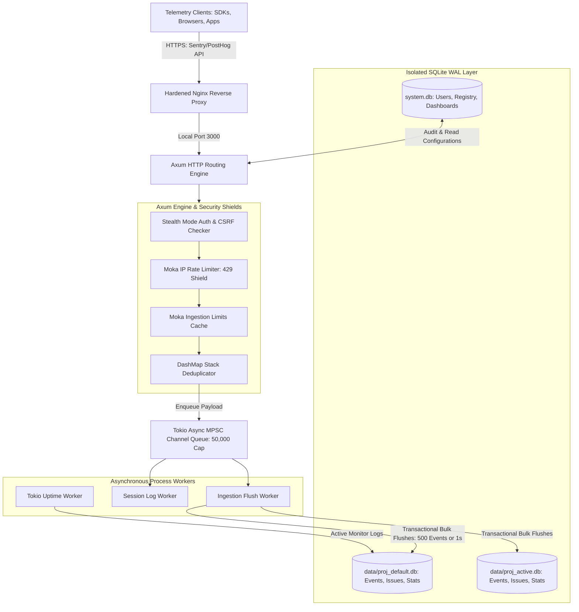
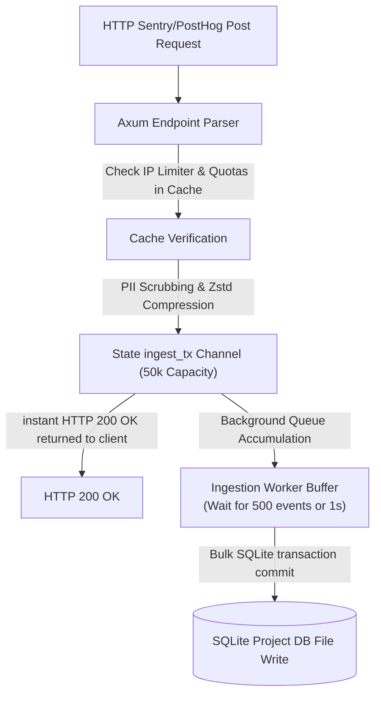

# 🧬 FortenLog Enterprise Architecture & Engineering Guide

Welcome to the definitive system architecture manual for the **FortenLog Telemetry & Analytics Platform**. This document provides an exhaustive, production-grade review of the platform's tech stack, multi-tenant storage models, asynchronous pipeline queuing, caching topologies, security measures, and offline UI design systems.

---

## 🗺️ High-Level System Architecture

FortenLog is built from the ground up as a **100% self-hosted, air-gapped, zero-external-dependency** telemetry collector and error tracking system. It exposes interfaces compatible with standard industry telemetry protocols (such as Sentry envelopes and PostHog capture schemas) while operating completely isolated on private intranets.

---

## 🛠️ 1. Core Technology Stack

The platform is constructed using modern, performance-critical, and memory-safe technologies to guarantee maximum throughput with minimum CPU and memory footprints.

### 🦀 Backend Engine
* **Rust (Axum Framework)**: The application server is built on top of Axum, leveraging Tower middlewares and Hyper for extreme network efficiency and native asynchronous performance.
* **Tokio Asynchronous Runtime**: Drives all background tasks, timers, connection pooling, and queue flushing.
* **rusqlite & r2d2 Connection Pooling**: Manages isolated multi-threaded connections to the SQLite database files.

### 🎨 Frontend UI
* **Pure Vanilla HTML5 / Vanilla CSS3 / Vanilla JavaScript**: Zero reliance on external build systems, Webpack, Babel, or external Javascript CDNs.
* **Local Asset Compilation (`rust_embed`)**: All UI pages, styles, scripts, typography, icons, and charting libraries are bundled directly into the compiled Rust binary at compile-time. This guarantees the platform is 100% functional in strictly isolated, air-gapped server environments.

---

## 💿 2. Data Architecture & Multi-Tenancy Isolation

FortenLog implements a strict **single-writer multi-tenant database isolation model**. Instead of bundling all project telemetries into a single massive SQL database which would suffer from read/write locking contentions, the database layer is partitioned.

### A. The Master Database (`data/system.db`)
Responsible for overall platform registry and system configurations:
* **Users & Access Control**: Admin roles, password hashes, and 2FA secrets.
* **Project Registry**: Project configurations, unique ingestion API keys, and storage volume policies.
* **Uptime Monitors**: Dynamic URL targets, timeout rules, and active polling intervals.
* **System Audit Logs**: Log entries recording administrative state modifications for security audits.

### B. Isolated Project Databases (`data/projects/<project_id>.db`)
Each registered project is allocated a dedicated, physically isolated SQLite database file. This file stores all project-specific telemetry details:
* `payloads`: Houses raw, compressed stack traces and payload documents.
* `stack_traces`: Normalized and hashed exception logs.
* `issues`: Grouped exception signatures tracking affected users, state (unhandled/resolved), last seen timestamps, and occurrences.
* `events`: High-resolution client context (Operating System, Browser, Region, Release Version, Environment).
* `sessions`: Real-time session stability logs.
* `uptime_logs`: History logs of active HTTP ping round-trip times.

### C. Concurrency Optimization: SQLite Write-Ahead Log (WAL) Mode
All project database connections are opened under **WAL (Write-Ahead Log) mode**.
* **Parallel Reads & Writes**: In standard SQLite, writes lock the entire database, blocking readers. In WAL mode, writes are appended to a separate log file, allowing parallel readers to read unmodified database pages concurrently.
* **Busy Timeout & Cache Size Tweak**: All pools are initialized with a `busy_timeout` of `5000ms` and custom page sizes to completely eliminate `SQLITE_BUSY` database lockouts under heavy ingestion.

---

## ⚡ 3. Asynchronous Ingestion & Persistence Engine

Ingestion of client telemetry utilizes a decoupled **ring-buffer queue pipeline**. Axum endpoints do not write directly to the database; they delegate execution to offloaded thread workers.

### Key Performance Properties:
* **MPSC Queue Isolation**: Axum endpoints parse the telemetry schema, scrub PII, and push the event straight into a highly efficient Tokio MPSC channel (`ingest_tx`). The client is immediately responded to with `200 OK` in **sub-millisecond latencies**.
* **Batch Persist Workers**: A background loop consumes from the queue, collecting events in a local buffer.
* **Dual-Trigger Flushing**: The buffer is flushed to SQLite in a single transaction only when **500 events** have accumulated OR **1 second** has passed since the last flush. This bypasses SQLite write limitations and yields speeds exceeding **2,500 persistent events/sec** on basic hardware.
* **Multi-Architecture Concurrency**: Executes natively with identical lock-free throughput on both **commodity x86_64** servers and **weakly-ordered ARM** environments (AWS Graviton, Ampere Altra) by utilizing strict atomic `Ordering::SeqCst` and `Ordering::Relaxed` memory fences.
* **Live Diagnostics Telemetry**: Tracks deep system telemetry (RSS Memory, MPSC Queue depths, network drop rates, flush failures) via an internal API without introducing blocking mutexes on the primary ingestion path.

---

## 🧠 4. Advanced In-Memory Cache Architecture

To protect both the SQLite storage engine and network throughput, FortenLog coordinates four specific in-memory caching levels.

### I. In-Memory Duplicate Stacking Cache (`DashMap`)
When a client application crashes in a tight loop (e.g., inside an animation loop or recursive thread), it may send thousands of identical exception reports in seconds.
* **Strategy**: The server computes an in-memory fingerprint `project_id-exception_type-exception_value`. This signature is checked against a thread-safe `DashMap` stack cache.
* **Throttling**: If identical exception signatures exceed **50 events per minute** for the same user, subsequent duplicates are accepted in memory and return `200 OK` instantly, but they are **never passed to the background queue or database**.

### II. IP Rate-Limiting Protection Shield (`Moka Cache`)
* **Strategy**: Implemented via a highly performant in-memory Moka cache with a sliding-window duration.
* **Rule**: Tracks client requests by IP. If a single IP pushes more than **100 ingestion requests within 60 seconds**, the IP is locked out, and all subsequent telemetry payloads are blocked at the HTTP layer, returning `429 Too Many Requests` in less than `0.3ms`.

### III. Dynamic Ingestion Quotas (`Moka Cache`)
* **Strategy**: Protects server disk limits by caching active project ingestion quotas (configured in storage settings).
* **Rule**: Records ingestion occurrences over 10-minute and 24-hour windows. If a project exceeds its assigned threshold (e.g., 50,000 events/day), all incoming payloads for that project are rejected.

### IV. Universal Dashboard Cache (`Moka Cache`)
* **Strategy**: Calculates and caches full aggregated dashboard statistics (`/api/dashboard/stats`).
* **Rule**: Evicts the cache key whenever a transaction batch is successfully committed by the background worker. This provides lightning-fast dashboard loads (<1.8ms) without polling the SQLite disks constantly.

---

## 🔒 5. Security & Cryptography Hardening

FortenLog is built under strict enterprise security mandates, preventing unauthorized information disclosure and mitigating platform tampering.

* **Argon2id User Hashing**: Master and administrative passwords are encrypted on the server using Argon2id with random secure salts, protecting against database breach enumeration.
* **Custom CSRF Header Protection**: State-changing administrative API routes are shielded from Cross-Site Request Forgery attacks. All internal `POST`, `PUT`, and `DELETE` requests must present a custom `X-FortenLog-Request: true` validation header. (Public ingestion endpoints like `/capture/` bypass this to ensure native SDK compatibility without patching).
* **Stealth Authentication Mode**: When enabled, the server hides all login and administration pathways from unauthorized scans by returning uniform error messages and standardized status codes, completely preventing credential brute-forcing.
* **Strict Security Bounding**: User credentials, TOTP settings, and active session revocations are securely partitioned in the personal User Settings context, explicitly preventing cross-tenant configuration overlaps.
* **Robust Global Audit Logging**: All operational configurations and user actions are recorded with defensive string fallback parsing and presented via a strictly corporate, emoji-free administrative interface.

---

## 🧹 6. Storage Maintenance, Backups & Compression

As a self-hosted engine, disk footprint efficiency is paramount. The platform maintains clean storage states through three key pipelines:

1. **ZSTD Decompression & Compression**: Large telemetry payloads (such as JSON error context dumps and variables) are compressed using the highly efficient Zstandard (ZSTD) compression algorithm before database storage.
2. **Dynamic Project Vacuuming**: Provides administrative API endpoints to execute SQLite `VACUUM` commands, rebuilding database files and reclaiming raw unused disk blocks.
3. **Automated Maintenance Cron Worker**: A dedicated background token-bucket scheduler continually runs retention purges, backup triggers, and auto-vacuums based on customized frequencies (e.g., `twice_daily` or `three_times_weekly`).
4. **Non-Blocking Point-in-Time Backups**: Automatically streams complete multi-tenant snapshot copies of both the system and project databases to `data/backups/` without ever dropping incoming network telemetry limits.

---

## 🟢 7. Uptime Monitoring Core

The server features a built-in, low-overhead active monitoring engine.
* **Task Spawning**: The system reads active monitor registries and spawns isolated Tokio timer routines.
* **Active Verification**: Periodically pings custom URLs via HTTP/HTTPS, measuring response times and tracking stability history.
* **Dynamic Persistence**: Results are pushed directly into the target project's `uptime_logs` SQLite table.

---

## 🎨 8. Offline Premium Aesthetics & UI Rules

To enforce premium quality and compatibility across remote network segments, the front-end design system strictly complies with these styling rules:

* **100% Offline-First Assets**: No Google Fonts or cloud CDNs are allowed. All premium fonts (e.g., *Inter*, *Outfit*, *Fira Code*) are downloaded and hosted locally inside the embedded `/ui/fonts/` asset directories.
* **Harmonious Sleek Dark Mode**: Designed using high-contrast dark CSS palettes (e.g., sleek slate background `#0d1117`, nord gray borders, glowing green successes `#2ea44f`, and vivid error states `#f85149`).
* **Pure CSS Micro-Animations**: Interactive elements utilize smooth hover transitions (`all 0.2s ease`) and custom loading animations to elevate user experience.
* **Local QR Codes**: TOTP 2FA setup utilizes a pure Javascript local canvas-based QR engine rather than hitting online rendering APIs.
