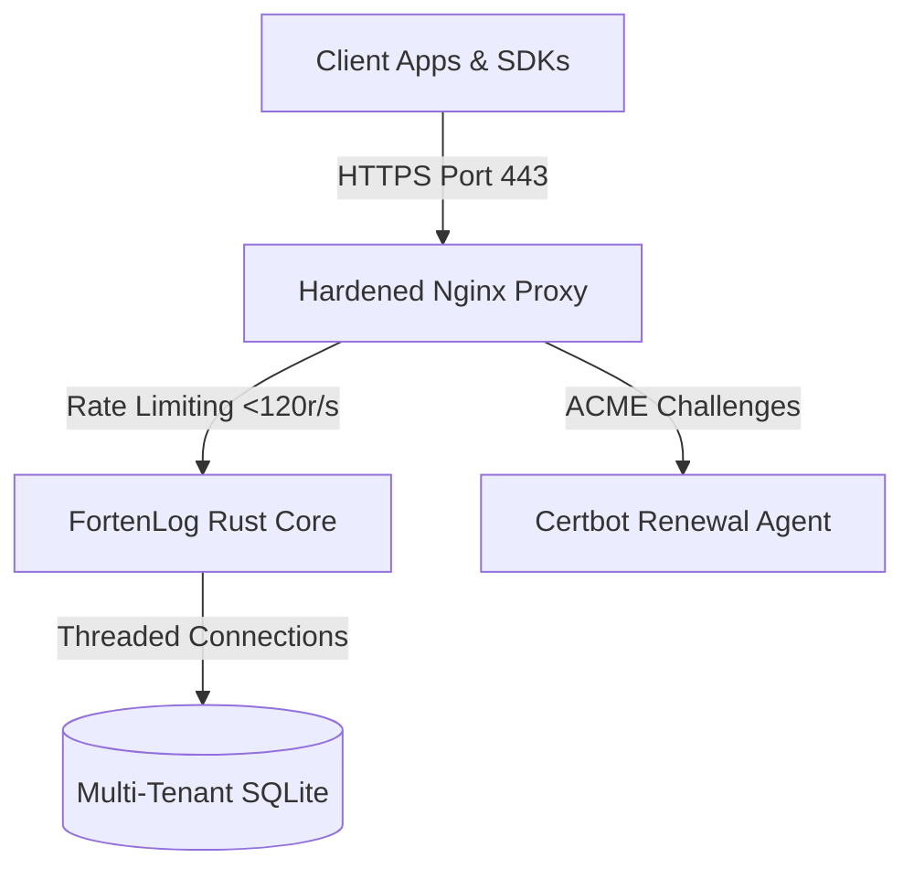

# 🚀 Enterprise Production Scaling & Deployment Guide

This guide details the steps to deploy FortenLog in a high-concurrency production VPS environment, scale its ingestion pipelines, and conduct live stress-testing validation.

---

## 🏗️ 1. Interactive One-Command Production VPS Deployer
FortenLog includes a dedicated `deployment/` suite designed for secure, rootless VPS orchestration on clean linux nodes. It is compatible with **Ubuntu, Debian, CentOS, RedHat, and Rocky Linux**.

### Setup and Interactive Installation
Log in to your VPS terminal, navigate to the repository root, and execute:

```bash
cd deployment
chmod +x prod_deploy.sh prod_update.sh
./prod_deploy.sh
```

### 🧙 What the Deployer Does Automatically:
1. **Host OS & Dependency Check**: Detects the host distribution package manager (`apt` or `dnf/yum`). If Docker or Docker Compose are missing, it installs the official Docker Engine and configures the system services automatically.
2. **Secure Credentials Generation**: Prompts for administrative parameters, generating a high-entropy random secure password if left empty, and writes them to a hardened `.env` file (`chmod 600`).
3. **Automated SSL Retrieval**:
   - **Let's Encrypt Mode**: Binds a temporary Nginx container to pass the ACME HTTP webroot validation challenge, requests production-grade certificates, and configures a Certbot cron agent to silently renew the SSL keys every 12 hours.
   - **Self-Signed Mode**: Generates a secure, 2048-bit local OpenSSL certificate chain (`/CN=domain`) for air-gapped sandboxes, internal test setups, or private intranets.
   - **HTTP Only Mode**: Strips SSL routing if FortenLog is placed behind an upstream load-balancer/proxy.

---

## 🔒 2. Production Hardened Proxy Architecture
The deployer configures an unprivileged, multi-container Docker cluster (`docker-compose.prod.yml`) consisting of three isolated components:



### 🛡️ Nginx Security Controls (`nginx.conf`)
* **Strict Transport Security (HSTS)**: Mandated via `Strict-Transport-Security "max-age=63072000; includeSubDomains; preload"`.
* **DDOS Shielding / Ingestion Limits**: Defines a high-performance memory zone (`limit_req_zone $binary_remote_addr zone=ingest_limit:10m rate=120r/s`). Any downstream client attempting to spam ingestion routes (`/api/*/envelope/` or `/capture/`) past the threshold is automatically blocked with an immediate **`429 Too Many Requests`** code, protecting memory and DB locks.
* **Content Security Policy (CSP)**: Blocks clickjacking and framing via `X-Frame-Options: DENY`, `X-Content-Type-Options: nosniff`, and restricted CSP tokens.
* **Privileged Isolation**: The main telemetry server operates as a completely rootless compiled binary inside an isolated Docker virtual bridge (`expose: 3000`), reachable only via the Nginx internal reverse-proxy.

---

## ♻️ 3. Zero-Downtime Maintenance & Upgrades
To fetch the latest git commits, rebuild/recompile assets, run migrations, and clean up lingering docker blocks without dropping a single active trace connection:

```bash
cd deployment
./prod_update.sh
```

---

## 🧬 4. High-Concurrency Stress & Scale Testing
Before exposing your server to production traffic, you can validate its scalability and rate-limiting thresholds by executing the parallel load tester:

```bash
node scripts/massive_api_test.js
```

### 📊 Validation Indicators (How to Read Output)
* **Concurrent Async Streams**: The script spawns **100 concurrent streams** (50 parallel Sentry errors + 50 PostHog custom setting changes) in less than a second (reaching peak rates >1,800 requests/sec).
* **Verify Rate-Limiting**: The telemetry server should allow the first wave of requests and immediately trigger **`Code 429` (Too Many Requests)** for the remainder of the burst, proving the network shield is functioning correctly.
* **Worker Queue Invalidation**: After the parallel burst, the script waits 2.5 seconds to allow the Rust transactional ingestion worker queue to flush and validates that database event indices grew strictly by the rate-limited transaction count.
